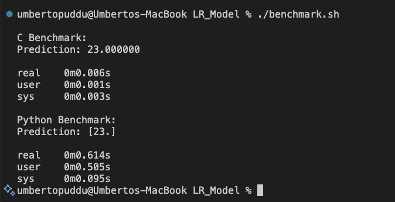

# Linear Regression Model in C



> A lightweight, self-contained linear regression implementation in pure C, featuring training, prediction, file persistence, and custom matrix/vector utilities — all built without relying on external libraries... AND A LOT FASTER THAN PYTHON !

---

## 📚 Table of Contents

- [📁 Project Structure](#-project-structure)
- [⚙️ Features](#️-features)
- [📚 API Reference](#-api-reference)
  - [LinearRegression](#lr_model-from-lr_modelh)
  - [Vector](#vector-api-from-vectorh)
  - [Matrix](#matrix-api-from-matrixh)
  - [🔧 Compilation](#-compilation)
- [🧠 How It Works](#-how-it-works)
- [🧱 Dependencies](#-dependencies)
- [🧼 Memory Management](#-memory-management)
- [🧪 Example Usage](#-example-usage-from-testerc)
- [🚀 Benchmark](#-benchmark)
- [📝 Future Improvements](#-future-improvements)
- [📄 License](#-license)

---

## 📁 Implemented Headers

```
.
├── LinearRegression.h       # Core linear regression model interface
├── matrix.h         # Matrix operations, including transpose and inversion
├── vector.h         # Vector operations used throughout the model
```

---

## ⚙️ Features

- Train a linear regression model using one or more features  
- Support for intercepts  
- Save and load models from disk  
- Custom vector/matrix algebra implementation  
- Designed to be simple and easily extensible  

---

## 📚 API Reference

### LinearRegression (from `LinearRegression.h`)

| Function | Description |
|----------|-------------|
| `LinearRegression *train_model(Feature *feats, Output *output, long feat_count, bool has_intercept)` | Train a linear regression model using features and output |
| `long double run_model(LinearRegression *model, data_row input)` | Run the model on a new input to get a prediction |
| `void save_model(LinearRegression *model, char *path)` | Serialize the model weights and metadata to a file |
| `LinearRegression *load_model(char *path)` | Load a serialized model from a file |
| `void free_model(LinearRegression *model)` | Free all memory used by the model |

---

### Vectors (from `vector.h`)

| Function | Description |
|----------|-------------|
| `Vector init_vec(long double *data, long size)` | Initialize a vector with provided data |
| `Vector empty_vec(long size)` | Create a vector of given size, initialized to zero |
| `void free_vec(Vector *v)` | Free memory allocated to a vector |
| `long double dot(Vector *v1, Vector *v2)` | Compute dot product between two vectors |

---

### Matrices (from `matrix.h`)

| Function | Description |
|----------|-------------|
| `Matrix init_matr(Vector *rows, long row_num)` | Initialize a matrix with an array of row vectors |
| `Matrix empty_matr(long row_num, long col_num)` | Create a zero-initialized matrix with given dimensions |
| `void free_matr(Matrix *m)` | Free memory allocated to the matrix |
| `long double *get_m_pos(Matrix *m, long row, long col)` | Get a pointer to a matrix element for direct modification |
| `long double get_m_val(Matrix *m, long row, long col)` | Retrieve a matrix value at a given position |
| `Vector *get_row(Matrix *m, long row_num)` | Get a pointer to a specific row vector |
| `Vector *get_col(Matrix *m, long col_num)` | Get a pointer to a specific column as a vector |
| `Matrix mul_matr(Matrix *m1, Matrix *m2)` | Matrix multiplication (m1 × m2) |
| `Matrix inv_matr(Matrix *m)` | Compute the inverse of a square matrix |
| `Matrix t_matrix(Matrix *m)` | Compute the transpose of a matrix |

---

### 🔧 Compilation

To compile and run the tester, ensure all `.c` files are included:

```bash
gcc tester.c LinearRegression.c matrix.c vector.c -o tester
./tester
```

Make sure all headers and implementations are in the same directory or adjust your includes accordingly.

---

## 🧠 How It Works

- A **Feature** consists of a name and a vector of data points.  
- An **Output** is simply a Feature representing the target variable.

### `train_model()`
Builds a model from features and output using the **Normal Equation**:

```
w = (XᵀX)⁻¹ Xᵀy
```

### `run_model()`
Computes predictions using the trained weights:

```
ŷ = wᵀ ⋅ x
```

### `save_model()` and `load_model()`
Provide persistence by saving/loading weights and model metadata to/from disk.

---

## 🧱 Dependencies

This is a **pure C** project — no external libraries are required. It is self-contained with custom implementations for vectors and matrices.

---

## 🧼 Memory Management

- Call `free_model()` after using your model  
- Free any vectors you initialize with `empty_vec()`  
- Free any matrices if you expand the project further  

> ✅ **If used properly, this implementation leaks 0 bytes of memory — guaranteed no memory leaks.**

---

## 🧪 Example Usage (from [`tester.c`](./tester.c))

```c
int n = 5; // Number of datapoints

// Allocate and initialize vectors for features and output.
// `empty_vec(int n)` returns a zero-initialized vector of length n.
Vector x = empty_vec(n), z = empty_vec(n), y = empty_vec(n);

int primes[5] = {2, 3, 5, 7, 11};

for (int i = 0; i < n; i++) {
    x.data[i] = i + 1;                   // x: 1, 2, 3, 4, 5
    z.data[i] = primes[i];               // z: 2, 3, 5, 7, 11
    y.data[i] = 1 + 2 * x.data[i] + 0.5 * z.data[i];  // Linear target function
}

// Create feature array using vectors x and z
Feature feats[2] = {
    { "x", x },
    { "z", z }
};

// Output vector for training
Output output = { "y", y };

// Train the linear regression model with intercept using the features and output.
// `train_model` fits the model and returns a pointer to it.
LinearRegression *model = train_model(feats, &output, 2, true);

// Define new test input: x = 6, z = 13
// Expected prediction: 1 + 2*6 + 0.5*13 = 19.5
long double input[] = { 6.0, 13.0 };

// Save the trained model to a file named "Test"
// `save_model` writes the model parameters to disk
save_model(model, "Test");

// Make a prediction using the trained model before saving
// `run_model` returns the predicted output for the given input features
printf("Prediction before save: %Lf\n", run_model(model, input));

// Free the memory allocated for the model
// `free_model` releases all resources associated with the model
free_model(model);

// Reload the model from the saved file "Test"
// `load_model` reads the model parameters from disk and returns a pointer
model = load_model("Test");

// Make a prediction using the reloaded model
printf("Prediction after load: %Lf\n", run_model(model, input));

// Free the model again after use
free_model(model);

// Free the memory allocated for all vectors
// `free_vec` releases internal data held by the vector
free_vec(&x);
free_vec(&z);
free_vec(&y);
```

---

## 🚀 Benchmark

I benchmarked this C implementation against Python’s `scikit-learn` using the small dataset provided in the repo.

- The **C version** completed inference in just a few **milliseconds** [`tester.c`](./tester.c)
- The **Python version** took over **600ms** [`tester.py`](./tester.py)

💥 That’s a **~100x speedup**, thanks to the low-level, no-overhead nature of C. Test it yourself !

---

## 📝 Future Improvements

- Implement regularization (e.g., Ridge regression)  
- Include gradient descent as an alternative to the Normal Equation  
- Add support for applying transformations to inputs and inverse transformations to outputs to model non-linear relationships.

---

## 📄 License

This project is open-source. Use it freely in your own projects!
